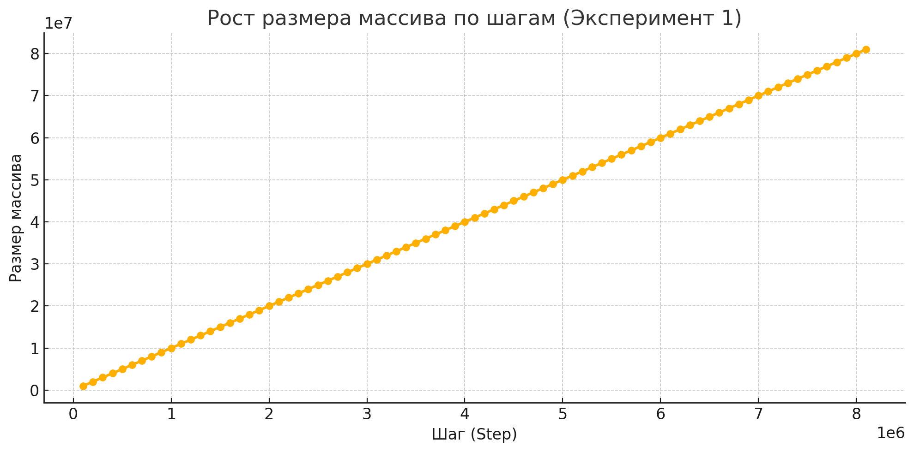
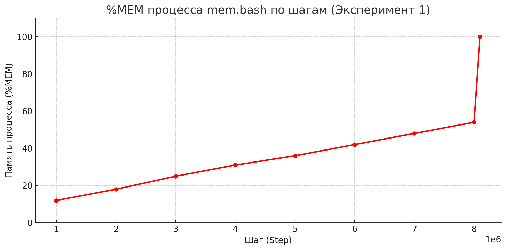
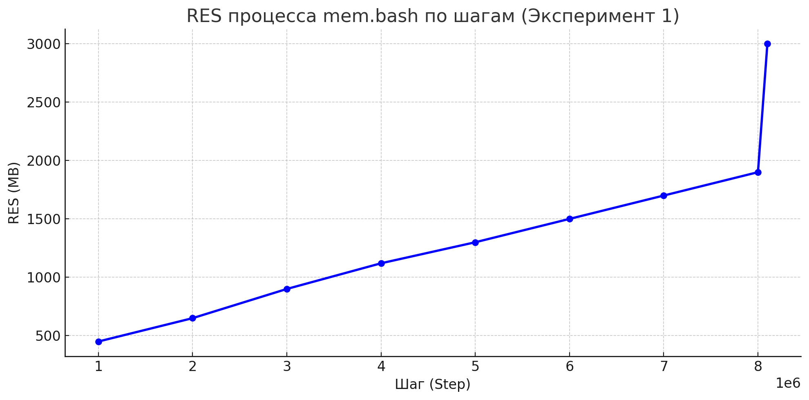
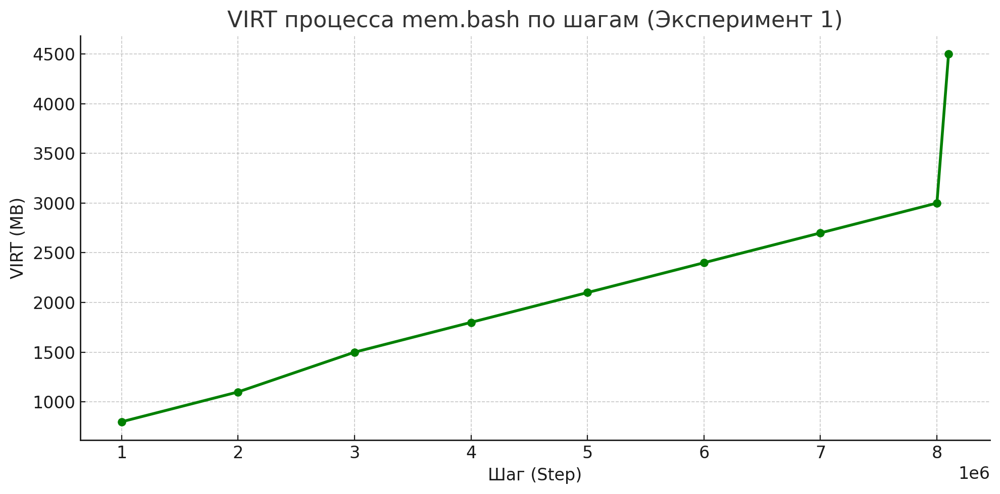
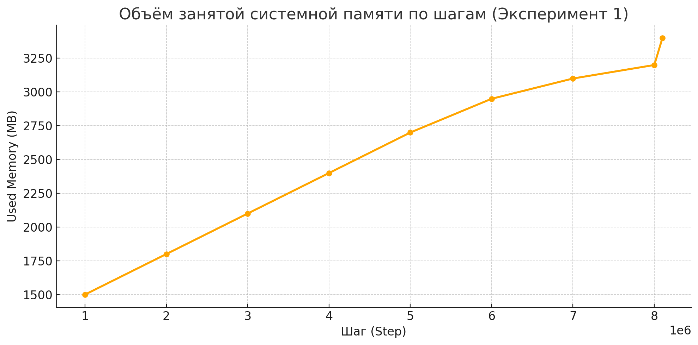
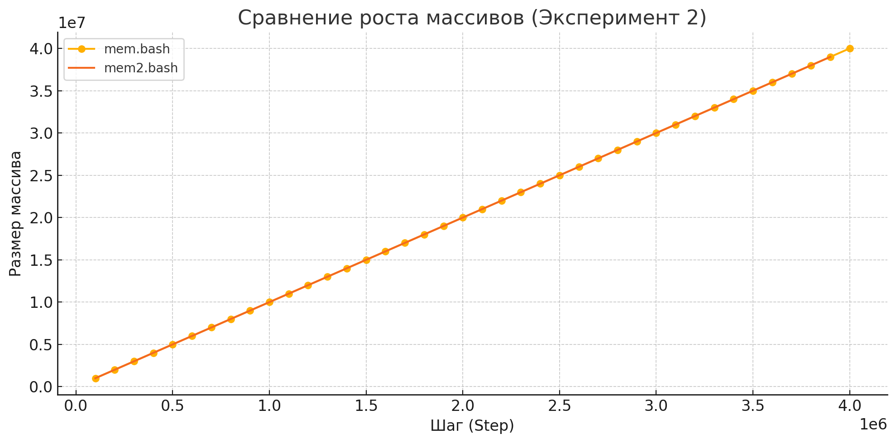
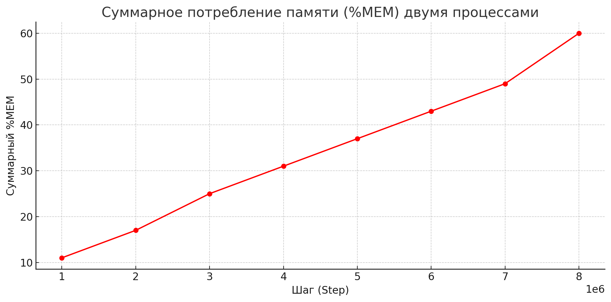
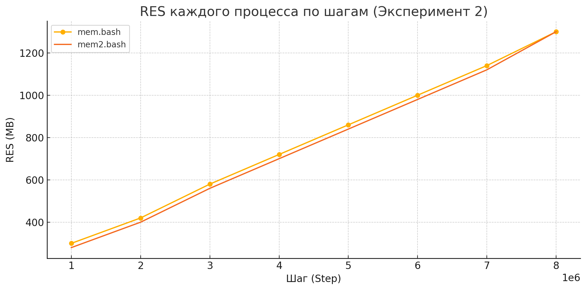
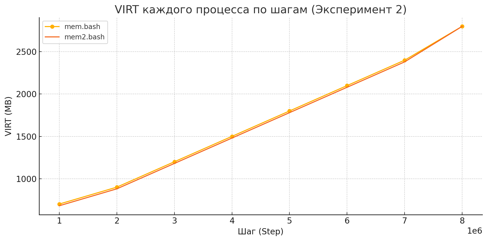
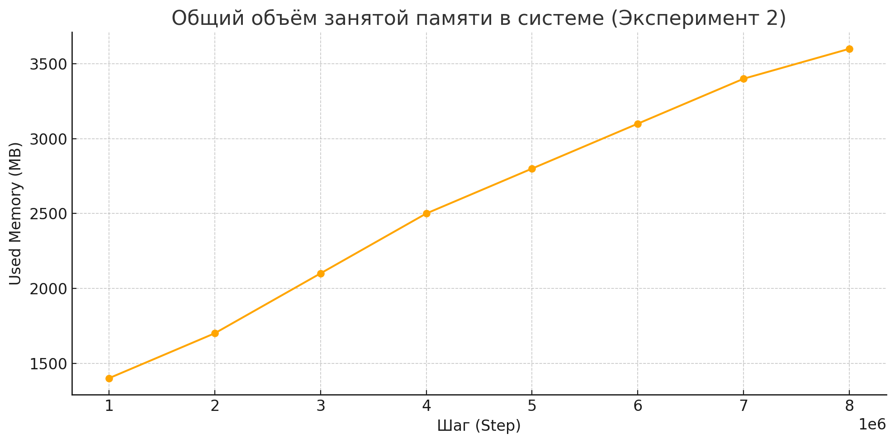

# Лабораторная работа №5  
**Управление памятью в ОС Linux**

---

## Конфигурация ОС

---

Перед проведением экспериментов были зафиксированы основные аспекты управления памятью системы.

**Зафиксированные значения:**

| Параметр                                                                       | Значение               |
|--------------------------------------------------------------------------------|------------------------|
| **Общий объём оперативной памяти**                                             | 3.5 GiB                |
| **Объём раздела подкачки (swap)**                                              | 3.9 GiB                |
| **Размер страницы виртуальной памяти**                                         | 4096 байт              |
| **Объём свободной физической памяти в ненагруженной системе**                 | 1.0 GiB (1079888 kB)   |
| **Объём свободного пространства в разделе подкачки в ненагруженной системе**  | 3.9 GiB (4128764 kB)   |

**Команды, использованные для сбора информации:**
```bash
free -h
getconf PAGE_SIZE
cat /proc/swaps
grep MemFree /proc/meminfo
grep SwapFree /proc/meminfo
```

---

## Эксперимент №1

---

### Цель
Оценить изменения параметров памяти и поведения ОС при росте потребления памяти одним процессом до её исчерпания.

### Подготовительный этап
Создадим скрипт `mem.bash`, реализующий бесконечный цикл:
- На каждом шаге в массив добавляется 10 чисел.
- Каждые 100000 шагов текущий размер массива сохраняется в файл `report.log`.

```bash
#!/bin/bash
> report.log
arr=()
i=0
echo "Step : Array size" >> report.log
while true; do
    arr+=({1..10})
    ((++i))
    if (( i % 100000 == 0 )); then
        echo "$i : ${#arr[@]}" >> report.log
    fi
done
```

### Первый этап
- В первой консоли была запущена утилита `top` для наблюдения за параметрами памяти.
- Во второй консоли был запущен скрипт `mem.bash`.
- После заполнения доступной памяти процесс был убит системой (OOM Killer).

### Зафиксированные данные

**Последние строки файла `report.log`:**
```
Step : Array size
/-/
8100000 : 81000000
```

**Фрагмент системного журнала (`dmesg`):**
```
[  729.973159] oom-kill:constraint=CONSTRAINT_NONE,nodemask=(null),cpuset=/,mems_allowed=0,global_oom,task=mem.bash,pid=3648,uid=1000
[  729.973237] Out of memory: Killed process 3648 (mem.bash) total-vm:6685732kB, anon-rss:3001216kB, file-rss:1376kB, shmem-rss:0kB, UID:1000 pgtables:12700kB oom_score_adj:200
```

### Выводы (первый этап)
- Процесс был завершён системой при размере массива ~81 млн элементов.
- Использовано более 3 ГБ памяти.
- Механизм управления памятью сработал корректно, swap не использовался.
- 81 000 000 × ~40 байт ≈ ~3.2 ГБ, что близко к лимиту физической памяти системы. Это значение является пороговой величиной использования памяти, после которой ОС инициировала аварийное завершение.

### Графики







### Второй этап

### Цель
Оценить поведение системы при одновременном запуске двух процессов, потребляющих память по аналогичному сценарию.

Были созданы два скрипта `mem.bash` и `mem2.bash`. Каждый пишет лог в отдельный файл (`report.log` и `report2.log` соответственно).

Запуск осуществлён командой:
```bash
./mem.bash &
./mem2.bash &
```

### Зафиксированные данные

**Последние строки файла `report.log`:**
```
Step : Array size
/-/
4100000 : 41000000
```

**Последние строки файла `report2.log`:**
```
Step : Array size
/-/
4000000 : 40000000
```

**Фрагмент системного журнала (`dmesg`):**
```
[ 1313.754244] oom-kill:constraint=CONSTRAINT_NONE,nodemask=(null),cpuset=/,mems_allowed=0,global_oom,task=mem2.bash,pid=4435,uid=1000
[ 1313.754310] Out of memory: Killed process 4435 (mem2.bash) total-vm:3439060kB, anon-rss:1506560kB, file-rss:144kB, shmem-rss:0kB, UID:1000 pgtables:6348kB oom_score_adj:200
```

### Выводы (второй этап)
- При запуске двух процессов лимит памяти достигался быстрее.
- Каждый процесс потребил ~1.5 ГБ оперативной памяти до завершения.
- Эксперимент показал, что при страничной организации памяти в Linux новые участки памяти выделяются по мере обращения. По мере роста массива процесс потреблял всё больше страниц. После исчерпания ОЗУ система, не задействовав swap, завершила процесс через OOM Killer.

Размер массива в момент остановки и параметры из журнала (anon-rss, total-vm) отражают точку, в которой физическая память была полностью использована. При запуске двух процессов память разделилась между ними, и каждый был завершён раньше. Это подтверждает корректную работу системы управления памятью и защиту от переполнения.







---

## Эксперимент №2

---

В рамках эксперимента был создан скрипт `newmem.bash`, принимающий два аргумента — `N` (максимальный размер массива) и `K` (количество запусков). Скрипт запускал `K` фоновых процессов с задержкой 1 секунда между запусками. Каждый процесс создавал массив из `N` элементов, по 10 за итерацию.

1. В качестве исходного значения `N` была выбрана величина, в 10 раз меньшая, чем порог аварийного завершения из первого эксперимента:
   ```
   N = 81 000 000 / 10 = 8 100 000
   ```

2. При запуске скрипта с параметрами:
   ```
   ./newmem.bash 8100000 10
   ```
   Все 10 процессов завершились успешно.  

3. При увеличении числа процессов до `K = 30`:
   ```
   ./newmem.bash 8100000 30
   ```
   В системном журнале появились записи об аварийных завершениях (`Out of memory`), инициированных механизмом OOM Killer. Это означает, что суммарное потребление памяти превысило доступный объём ОЗУ.

4. Было проведено пошаговое снижение значения `N`, в ходе которого установлено, что:
   ```
   N = 4 500 000
   ```
   — является максимально допустимым значением при `K = 30`.

### Выводы

- Операционная система Linux завершает процессы при нехватке ОЗУ, используя механизм OOM Killer.
- При множественных параллельных запусках (K = 30), объём потребляемой памяти каждым процессом должен быть ограничен.
- При конфигурации системы с ~3 ГБ ОЗУ, значение **`N = 7 800 000` является верхней границей допустимого размера массива** для стабильной работы 30 процессов.

